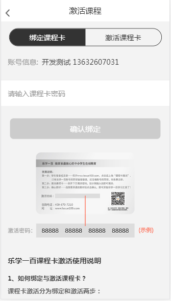
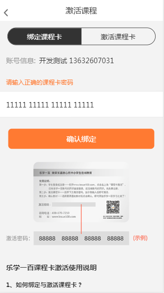
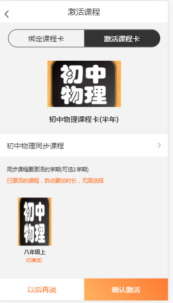
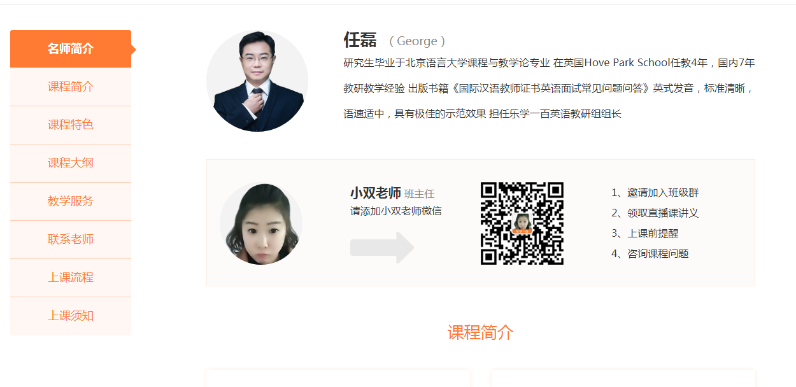

#h5版课程卡激活

## 预览
- 
- 
- 
- 
- 

## 技术站
- javascript jquery  css 用的**rem**单位

## 功能
- 实现课程卡绑定
- 显示激活的课程卡和未激活的课程卡
- 显示绑定的课程
- 激活的话可以选择教材版本和年级进行激活。

## 课程详情页  

## 最后 [课程卡激活pc端地址](https://www.lexue100.com/mk.php?do=kcard);[h5课程卡激活地址](https://www.lexue100.com/mh5.php?do=me&mdo=active_kcard2)
